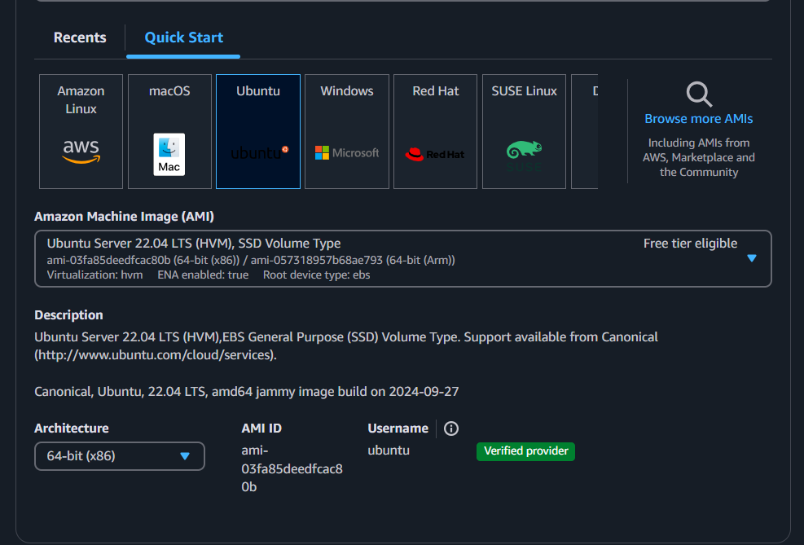
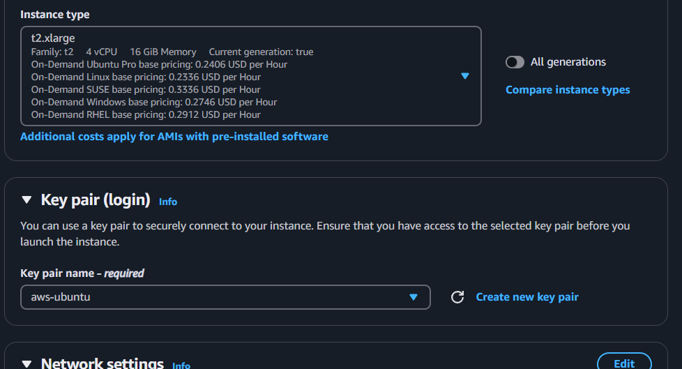
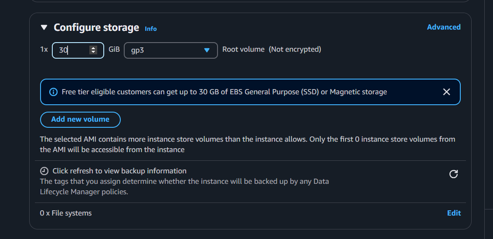

# MLOps Maturity Model

## Create AWS EC2
1. Go to `AWS EC2` then `launch instances`.
2. Setup up based on these images.

## 
| Level | Description | Information |
| -------- | -------- | -------- |
| 0 | No MLOps | - All code in Jupyter |
| 1 | DevOps, no MLOps | - |
| 2 | Automated Training | - Training Pipeline   - Experiment Tracking   - Model Registry |
| 3 | Automated Model Deployment | - A/B Test   - Model Monitoring |
| 4 | Full MLOps Automated Operation | - Trigger retraining based on production metric   - Automatic Training   - Automatic Deployment |