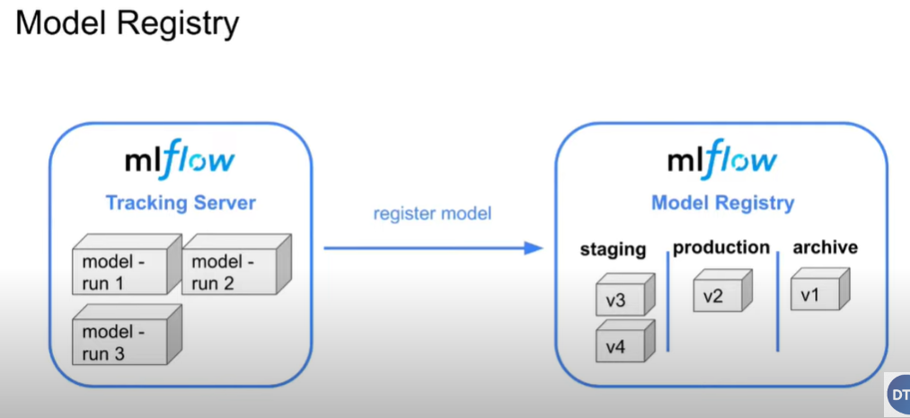

# Experiment Tracking - MLflow

## <ins>Introduction</ins>
There are numerous experiment tracking tools exist to assist in managing experiments and other components including parameters, metrics, models, artifacts, etc. Tools such as MLflow, DVC, ClearML, Comet ML, Weights & Biases and many more are readily available in the market, offering both free and paid services. MLflow, being a free and open-source tool, will be implemented in workflow. 

## <ins>MLflow`s Command-line Interface</ins>
Below is the command to interacting with MLflow.
<br />
`mlflow ui` <- execute this if prefer to stole experimental data as mlflow.yaml
<br />
`mlflow ui --backend-store-uri sqlite:///mlflow.db` <- execute this if prefer to stole experimental data as SQLite database

## <ins>Experiment Tracking with MLflow</ins>
<ins>1. Create experiment</ins>
<br />
The provided code snippet sets up an MLflow tracking server using SQLite as the backend store. The `mlflow.set_tracking_uri("sqlite:///mlflow.db")` command will set the tracking URI to a SQLite database named `mlflow.db`, automatically create it if the experiment does not exist. The database will be used to store experiment metadata. The `mlflow.set_experiment("nyc-taxi-experiment")` command creates a new experiment named "nyc-taxi-experiment". If an experiment with this name already exists, it will be reused. This command also creates a directory named mlruns where the experiment data will be stored.

```
# create SQLite mflow.db
mlflow.set_tracking_uri("sqlite:///mlflow.db")
# this will create experiment based on provide name
# also create mlruns folder
mlflow.set_experiment("nyc-taxi-experiment")
```

<ins>2. Delete experiment</ins>
<br />
This command used to remove MLflow experiment, identified by its ID.
<br />
```
mlflow.delete_experiment(experiment_id = '1')
```
An error will occur if attempt to create a new experiment with the same name as a deleted one.

```
MlflowException: Cannot set a deleted experiment 'nyc-taxi-experiment' as the active experiment. You can restore the experiment, or permanently delete the experiment to create a new one.
```
To permanently delete the experiment, execute the following command.
```
mlflow gc --backend-store-uri sqlite:///mlflow.db --experiment-ids 1
```
There are interesting discussion for this issue, kindly refer https://stackoverflow.com/questions/60088889/how-do-you-permanently-delete-an-experiment-in-mlflow.

<ins>3. Log and track machine learning experiment</ins>
<br />
The provided code snippet demonstrates how to log, track, save machine learning experiments using MLflow.
<br />
```
with mlflow.start_run():
    # log detail
    mlflow.set_tag("developer", "christopher")

    # log parameter
    mlflow.log_param("train-data-path", "../data/green_tripdata_2021-01.csv")
    mlflow.log_param("valid-data-path", "../data/green_tripdata_2021-02.csv")

    alpha = 0.1

    # log parameter
    mlflow.log_param("alpha", alpha)

    lr = Lasso(alpha)
    lr.fit(x_train, y_train)

    y_pred = lr.predict(x_val)

    rmse = root_mean_squared_error(y_val, y_pred)

    # log rmse metric
    mlflow.log_metric("rmse", rmse)

    # save model locally
    with open('models/lin_reg.bin', 'wb') as f_out:
        pickle.dump((dv, lr), f_out)

    # log artifact for model
    mlflow.log_artifact(local_path = "models/lin_reg.bin", artifact_path = "models_pickle")
```

<ins>4. XGboost & Hyperopt with MLflow</ins>
<br />
The provided code snippet demonstrates how to log and track XGboost & Hyperopt to find its best parameters using MLflow. The process may take a few hours to find the optimal parameters, but it can be stopped at any time based on preference. 
<br />
```
train = xgb.DMatrix(x_train, label = y_train)
valid = xgb.DMatrix(x_val, label = y_val)

def objective(params):
    with mlflow.start_run():
        # log detail
        mlflow.set_tag("developer", "christopher")
        # log detail
        mlflow.set_tag("model", "xgboost")
        # log parameter
        mlflow.log_params(params)

        booster = xgb.train(
            params = params,
            dtrain = train,
            num_boost_round = 1000,
            evals = [(valid, 'validation')],
            early_stopping_rounds = 50
        )

        y_pred = booster.predict(valid)
        rmse = root_mean_squared_error(y_val, y_pred)

        # log metric
        mlflow.log_metric("rmse", rmse)

    return {'loss': rmse, 'status': STATUS_OK}

# search space to find the best hyperparameter
search_space = {
    'max_depth': scope.int(hp.quniform('max_depth', 4, 100, 1)),
    'learning_rate': hp.loguniform('learning_rate', -3, 0),
    'reg_alpha': hp.loguniform('reg_alpha', -5, -1),
    'reg_lambda': hp.loguniform('reg_lambda', -6, -1),
    'min_child_weight': hp.loguniform('min_child_weight', -1, 3),
    'objective': 'reg:squarederror',
    'seed': 42
}

best_result = fmin(
    fn = objective,
    space = search_space,
    algo = tpe.suggest,
    max_evals = 50,
    trials = Trials()
)
```
In the MLflow UI, kindly filter for `tags.model = 'xgboost'`. Then, sort the RMSE in a ascending order to identify the best model. Once you've found it, retrieve its optimal parameters. May click `compare` button to have more insight on optimal parameters.

<ins>5. XGboost with best parameters</ins>
<br />
The following code snippet demonstrates how to train an XGBoost model using the best parameters obtained from previous step.
```
# use best parameter to train the model
params = {
    'learning_rate': 0.6653267087715755,
    'max_depth': 20,
    'min_child_weight': 19.965812980250803,
    'objective': 'reg:squarederror',
    'reg_alpha': 0.18289424399274412,
    'reg_lambda': 0.0969372299406269,
    'seed': 42
}

# enable autolog
mlflow.xgboost.autolog(disable = False)

with mlflow.start_run():
    booster = xgb.train(
        params = params,
        dtrain = train,
        num_boost_round = 1000,
        evals = [(valid, 'validation')],
        early_stopping_rounds = 50
    )
```
Below image is the overview of metrics after training.


<ins>5. Load model with MLflow</ins>
<br />
By modifying the code from with `mlflow.start_run():` to `with mlflow.start_run() as run:`, we can acquire the run id. This allows us to load the model from the tracking server

```
# obtain run id
run_id = run.info.run_id

# load model from MLflow
logged_model = f'runs:/{run_id}/model'
loaded_model = mlflow.pyfunc.load_model(logged_model)
xgboost_model = mlflow.xgboost.load_model(logged_model)

y_pred = xgboost_model.predict(valid)
```

## <ins>Model Registry with MLflow</ins>
MLflow's model registry provides a platform for storing and versioning trained machine learning models. This feature greatly simplify the task of tracking and managing models. It also facilitates the transition of models through various stages such as `staging`, `production`, and `archive`.

- `staging` > Move model when it's ready for testing or review.
- `production` > Move model that has been tested and reviewed and is ready to be used for making actual predictions in a live application.
- `archive` > When model version is no longer in use, you can move it to this stage.



<ins>1. Access to tracking server</ins>
```
# access to tracking server
MLFLOW_TRACKING_URI = "sqlite:///mlflow.db"

client = MlflowClient(tracking_uri = MLFLOW_TRACKING_URI)
client.search_experiments()
```

<ins>2. Create experiment</ins>
```
# create experiment
client.create_experiment(name = "my-cool-experiment")
```

<ins>3. Filter RMSE</ins>
```
# filter RMSE based on selected criteria
runs = client.search_runs(
    experiment_ids = '1',
    filter_string = "metrics.rmse < 7",
    run_view_type = ViewType.ACTIVE_ONLY,
    max_results = 5,
    order_by = ["metrics.rmse ASC"]
)

for run in runs:
    print(f"run id: {run.info.run_id}, rmse: {run.data.metrics['rmse']:.4f}")
```

<ins>4. Register model</ins>
```
# register model
mlflow.set_tracking_uri(MLFLOW_TRACKING_URI)

run_id = "56a535cc40b342b68c60dc87c8f559be"
model_uri = f"runs:/{run_id}/model"

mlflow.register_model(model_uri = model_uri, name = "nyc-taxi-regressor")
```

<ins>5. View all registered model</ins>
```
# view all registered models
model_name = "nyc-taxi-regressor"
latest_versions = client.search_model_versions(f"name='{model_name}'")

for version in latest_versions:
    print(f"version: {version.version}, stage: {version.current_stage}")
```

<ins>6. Move model to specific stage</ins>
```
# move model to staging
model_version = 3
new_stage = "Staging"

client.transition_model_version_stage(
    name = model_name,
    version = model_version,
    stage = new_stage,
    archive_existing_versions = False
)
```

<ins>7. Update registered model</ins>
```
# update registered model data
date = datetime.today().date()

client.update_model_version(
    name = model_name,
    version = model_version,
    description = f"The model version {model_version} was transitioned to {new_stage} on {date}"
)
```

<ins>8. Model prediction</ins>
```
# model prediction
model = mlflow.pyfunc.load_model(f"models:/{name}/{stage}")
y_pred = model.predict(x_test)
```

<ins>9. Model transition to production</ins>
```
# model transition to production
client.transition_model_version_stage(
    name = model_name,
    version = 3,
    stage = "Production",
    archive_existing_versions = True
)
```