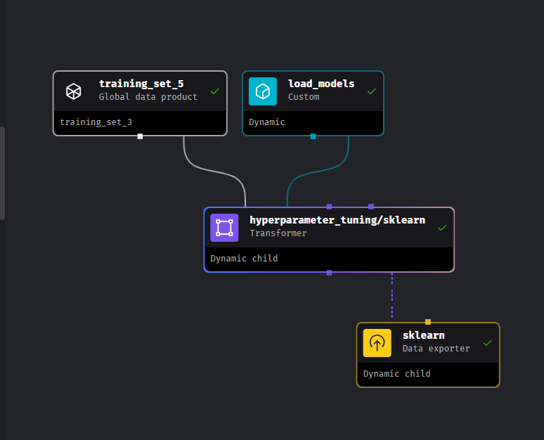
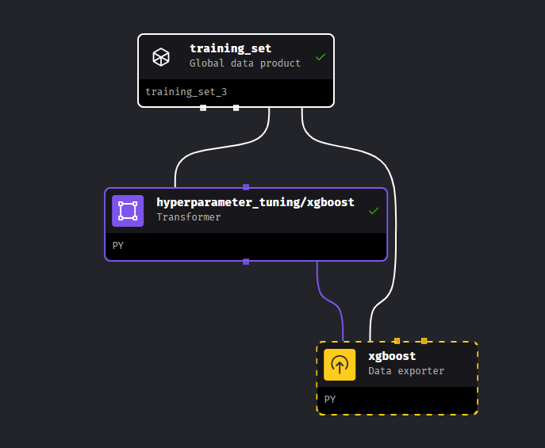

## Orchestration - Mage

### <ins>1. Introduction - ML Pipeline & Mage</ins>
Mage is orchestrator tool, it is an open-source pipeline tools for orchestrating, transforming and integrating data.

### <ins>Mage in Codespaces</ins>
1. Forked from [`mage-ai/mlops`](https://github.com/mage-ai/mlops).
2. Find `Create codespace on master` and click it.
3. Docker container is available in codespaces. In the command prompt, run the following command.
```bash
    ./scripts/start.sh
```
4. Once the Docker container finishes starting up, navigate to `PORTS` in codespaces to obtain url with port `6789` then run it in web browser.
5. Alternatively, you can run it in your local VS Code by execute `Open in VS Code Desktop`.
6. To use `mage start mlops`, install this.
```bash
pip install botocore mage-ai
```

### <ins>Window with docker-compose</ins>
1. Clone the respository
```bash
git clone https://github.com/mage-ai/mlops.git
cd mlops
```
2. Code modification

`start.sh`
```bash
export PROJECT_NAME=mlops
export MAGE_CODE_PATH=home/src
export SMTP_EMAIL=$SMTP_EMAIL
export SMTP_PASSWORD=$SMTP_PASSWORD
docker-compose up
```

`docker-compose.yml`
```bash
volumes:
    # Mount your local codebase to the container.
    - "${PWD}:/${MAGE_CODE_PATH}"
    # Store the data output on local machine to easily debug (optional).
    - "~/.mage_data:/${MAGE_CODE_PATH}/mage_data"
    # Initial credentials to create an IAM user with limited permissions for deployment.
    - "~/.aws:/root/.aws"
    # Local machine’s SSH keys to pull and push to your GitHub repository.
    - "~/.ssh:/root/.ssh:ro"
    # Local machine’s GitHub configs
```

3. Launch Mage and database service (PostgreSQL)
```bash
./scripts/start.sh
```

4. Open [`http://localhost:6789`](http://localhost:6789) in browser.

### <ins>2. Data Preparation -  ETL & Feature Engineering</ins>
1. New Project
    - Use `New Mage Project` to create a project named `unit_1_data_preparation`.
    - Navigate to `Settings > Settings` to `Register project`, if required.
    - While in `mlops > unit_1_data_preparation`, click the `New pipeline` button then choose the `Standard (batch)` option to create a pipeline named `Data preparation`.
2. Ingest Data
    - While in `mlops > unit_1_data_preparation > Pipelines > data_preparation`, navigate to `All blocks` to create `Data loader` block with name `Ingest`.
    - Click `Data loader` then choose `Base template (generic)` option.
    - Copy this code [`ingest.py`](https://github.com/mage-ai/mlops/blob/master/mlops/unit_3_observability/data_loaders/ingest.py).
    - If the time chart isn't displayed, insert the following snippet.
    ```bash
    df = pd.read_parquet(BytesIO(response.content))
    # start
    df['lpep_pickup_datetime_cleaned'] = df['lpep_pickup_datetime'].astype(np.int64) // 10 ** 9
    # end
    dfs.append(df)
    ```
    - Create any type of charts using the available data.
3. Utility
    - In the `utils/data_preparation` directory, create the `cleaning.py`, `feature_selector.py`, `feature_engineering.py` and `splitters.py` files.
    - Copy code from [`utils/data_preparation`](https://github.com/mage-ai/mlops/tree/master/mlops/utils/data_preparation).
    - Create `__init__.py` in the `utils/data_preparation` directory for package initialization.
4. Transformer
    - Navigate to `All blocks` to create `Transformer` block with name `Prepare`.
    - Click `Transformer` then choose `Base template (generic)` option.
    - Copy code from [`prepare.py`](https://github.com/mage-ai/mlops/blob/master/mlops/unit_3_observability/transformers/prepare.py).
    - Create global variables.
    ```bash
    split_on_feature_value -> 2024-02-01
    split_on_feature -> lpep_pickup_datetimes
    target -> duration
    ```
    - Modify on `prepare.py` code.
    ```bash
    split_on_feature = kwargs.get('split_on_feature')
    split_on_feature_value = kwargs.get('split_on_feature_value')
    target = kwargs.get('target')
    ```
    - To visualize the prepared data, choose `Histogram` and then adjust the code as follows.
    ```bash
    import pandas as pd

    from mage_ai.shared.parsers import convert_matrix_to_dataframe

    if isinstance(df_1, list) and len(df_1) >= 1:
        item = df_1[0]
        if isinstance(item, pd.Series):
            item = item.to_frame()
        elif not isinstance(item, pd.DataFrame):
            item = convert_matrix_to_dataframe(item)
        df_1 = item

    columns = df_1.columns
    col = 'trip_distance'
    x = df_1[df_1[col] <= 20][col]
    ```
5. Encoder
    - Create `encoder.py` in `utils/data_preparation`.
    - Copy code from [`encoder.py`](https://github.com/mage-ai/mlops/blob/master/mlops/utils/data_preparation/encoders.py).
    - Click `Data exporter` then choose `Base template (generic)` option.
6. Build training/ validation sets with unit test
    - Navigate to `All blocks` to create `Data exporter` block with name `Build`.
    - Click `Data exporter` then choose `Base template (generic)` option.
    - Copy code from [`build.py`](https://github.com/mage-ai/mlops/blob/master/mlops/unit_3_observability/data_exporters/build.py).

### <ins>3. Training - Sklearn Model & XGBoost</ins>
### <ins>3.1. Sklearn Model</ins>
1. Under `unit_2_training` folder, import pipeline `data_preparation` from `unit_1_data_preparation` folder.
2. Register `Training set` as a `global data product`. Choose the `data_preparation` pipeline, then the `build` block.Set `Outdated after` to `600` seconds.
3. Create new pipeline named `sklearn training`, populate content to `description` as needed.
4. Create new block for `Training set` from `global data product` lists.
5. Create custom `Python block` named `Load models`, choose `teal` as color. Copy code from [`load_models.py`](https://github.com/mage-ai/mlops/blob/master/mlops/unit_3_observability/custom/load_models.py). Finally, click `Set block as dynamic`.
6. Optionally, create `Markdown` block named `Dynamic block` between `Training set` block and `Load models` block.
7. Click `Transformer` then choose `Base template (generic)` option, name it as `Hyperparameter tuning/sklearn`. Copy code from [`transformers/hyperparameter_tuning/sklearn.py`](https://github.com/mage-ai/mlops/blob/master/mlops/unit_3_observability/transformers/hyperparameter_tuning/sklearn.py)
8. Create new file `hyperparameters/shared.py` under `utils` folder, copy code from [`utils/hyperparameters/shared.py`](https://github.com/mage-ai/mlops/blob/master/mlops/utils/hyperparameters/shared.py). Finally, create `__init__.py` under `hyperparameters` folder.
9. Create new file `models/sklearn.py` under `utils` folder, copy code from [`utils/models/sklearn.py`](https://github.com/mage-ai/mlops/blob/master/mlops/utils/models/sklearn.py). Finally, create `__init__.py` under `models` folder.
10. Create global variables `max_evaluations = 50` and `random_state = 7`.
11. Click `Data exporter` then choose `Base template (generic)` option. Name the block as `sklearn`, copy code from [`data_exporters/sklearn.py`](https://github.com/mage-ai/mlops/blob/master/mlops/unit_3_observability/data_exporters/sklearn.py).



### <ins>3.2. XGBoost</ins>
1. Create new pipeline named `xgboost training`, populate content to `description` as needed.
2. Create new block for `Training set` from `global data product` lists.
3. Create `Transformer` block, name it as `Hyperparameter tuning/XGBoost`. Code code from [`transformers/hyperparameter_tuning/xgboost.py`](https://github.com/mage-ai/mlops/blob/master/mlops/unit_3_observability/transformers/hyperparameter_tuning/xgboost.py).
4. Create new file `utils/models/xgboost.py`, copy code from [`utils/models/xgboost.py`](https://github.com/mage-ai/mlops/blob/master/mlops/utils/models/xgboost.py).
5. Create new file `utils/logging.py`, copy code from [`utils/logging.py`](https://github.com/mage-ai/mlops/blob/master/mlops/utils/logging.py).
6. Add global variable `max_evaluations = 3`, `early_stopping_rounds = 3` and `max_depth = 10`.
7. Create `Data exporter` block, name it as `XGBoost`. Copy code from [`data_exporters/xgboost.py`](https://github.com/mage-ai/mlops/blob/master/mlops/unit_3_observability/data_exporters/xgboost.py).



### <ins>4. Observability - Monitoring & Alerting</ins>

### <ins>5. Triggering - Inference & Retraining</ins>

### <ins>6. Deploying - Running Operation in Production</ins>

### <ins>7. Issue</ins>
1. Codespaces
<br>Docker auto-creates `.gitconfig` as a directory instead of a file.
```bash
warning: unable to access '/home/codespace/.gitconfig': Is a directory
warning: unable to access '/home/codespace/.gitconfig': Is a directory
```
