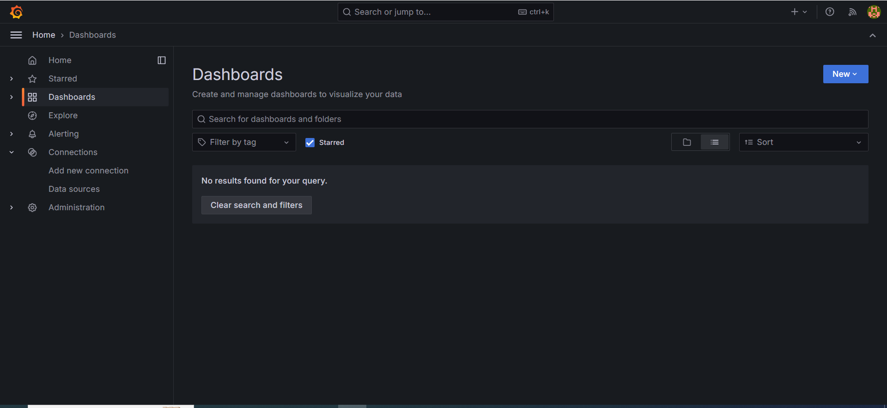

### Model Monitoring

#### 1. Introduction

#### 2. Docker
The Docker Compose configuration `docker-compose.yml` has three key services: `db`, `adminer`, and `grafana`. Additionally, it establishes two networks: `front-tier` and `back-tier`, and creates a volume named `grafana_data`.

- `db`: PostgreSQL, serving as primary data storage for metrics.<br>
This service uses the `postgres` image. It restarts automatically if it stops, uses the `back-tier` network, and exposes port 5432.
- `adminer`: Convenient database management interface.<br>
This service uses the `adminer` image. It restarts automatically if it stops, uses both the `back-tier` and `front-tier` networks, and exposes port 8080.
- `grafana`: Visualization and monitoring tool.<br>
This service uses the `grafana/grafana` image. It restarts automatically if it stops, uses both the `back-tier` and `front-tier` networks, and exposes port 3000. It also mounts several volumes for configuration and dashboards. Refer `config` > `grafana_dashboards.yaml` and `grafana_datasources.yaml`. `Dashboards` folder will share files between the host and the container.

To launch all necessary services, run the following command:

```
docker-compose up
```

Overview of Grafana Dashboard
