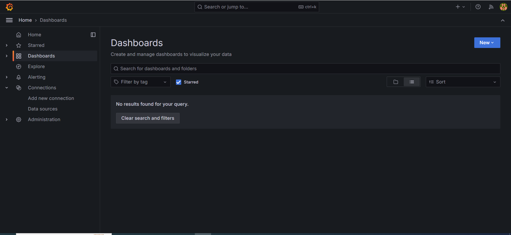
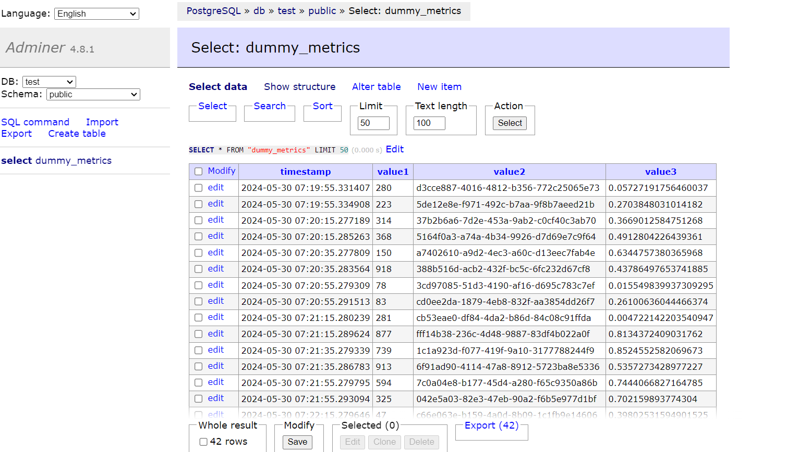

### Model Monitoring

#### 1. Introduction

#### 2. Evidently
Evidently AI is an open-source Machine Learning (ML) observability platform. It provides tools for analyzing and visualizing the performance and behavior of ML models. With Evidently AI, we can monitor data drift, model performance, and other important metrics over time. This helps in identifying issues early and ensuring that your models continue to make accurate predictions. The platform is designed to be easy to use and integrate into existing ML workflows, making it a valuable tool for data scientists and ML engineers. Kindly refer `baseline_model_nyc_taxi_data.ipynb` for a demonstration of these tools.

#### 3. Docker
The Docker Compose configuration `docker-compose.yml` has three key services: `db`, `adminer`, and `grafana`. Additionally, it establishes two networks: `front-tier` and `back-tier`, and creates a volume named `grafana_data`.

- `db`: PostgreSQL, serving as primary data storage for metrics.<br>
This service uses the `postgres` image. It restarts automatically if it stops, uses the `back-tier` network, and exposes port 5433.
- `adminer`: Convenient database management interface.<br>
This service uses the `adminer` image. It restarts automatically if it stops, uses both the `back-tier` and `front-tier` networks, and exposes port 8080.
- `grafana`: Visualization and monitoring tool.<br>
This service uses the `grafana/grafana` image. It restarts automatically if it stops, uses both the `back-tier` and `front-tier` networks, and exposes port 3000. It also mounts several volumes for configuration and dashboards. Refer `config` > `grafana_dashboards.yaml` and `grafana_datasources.yaml`. `Dashboards` folder will share files between the host and the container.

To launch all necessary services, run the following command:

```
docker compose up
docker compose up --detach # execute this if prefer to run in background
```

Overview of Grafana Dashboard


Overview of Adminer


#### Step by Step Monitoring Example
Starting docker services
<br>
To start all required services, execute:
```
docker compose up
docker compose up --detach # execute this if prefer to run in background
```

Sending dummy data
<br>
To calculate dummy and send them to database, execute:
```
python dummy_metrics_calculation.py
```

Sending data
<br>
To calculate evidently metrics with prefect and send them to database, execute:
```
python evidently_metrics_calculation.py
```

Stopping docker services
<br>
To stop all services, execute:
```
docker compose down
```